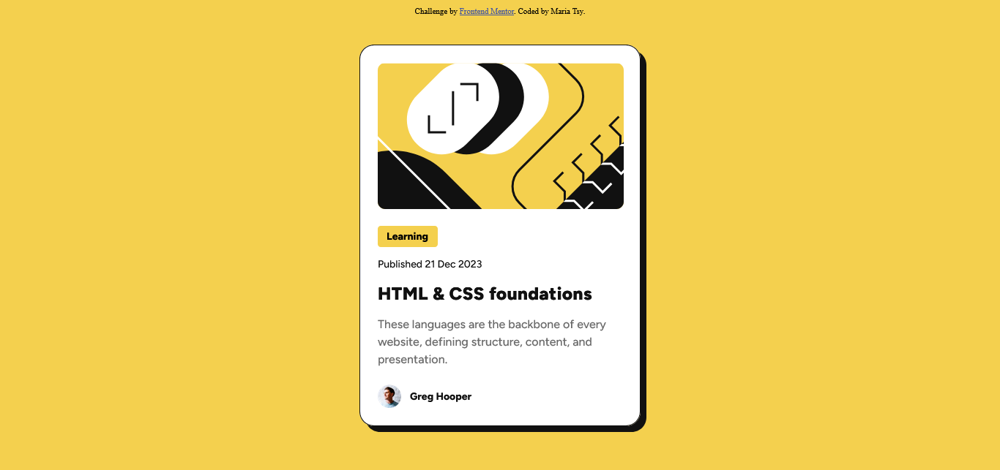
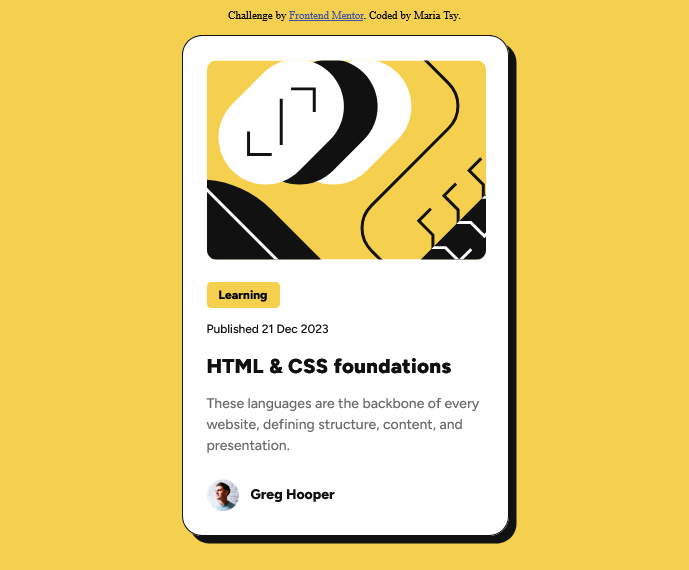

# Frontend Mentor - Blog preview card solution
This is a solution to the [Blog preview card challenge on Frontend Mentor](https://www.frontendmentor.io/challenges/blog-preview-card-ckPaj01IcS). Frontend Mentor challenges help you improve your coding skills by building realistic projects. 

## Table of contents
- [Overview](#overview)
  - [Screenshot](#screenshot)
  - [Links](#links)
- [My process](#my-process)
  - [Built with](#built-with)
  - [What I learned](#what-i-learned)
  - [Continued development](#continued-development)
  - [Useful resources](#useful-resources)
- [Author](#author)
- [Acknowledgments](#acknowledgments)

## Overview
This is just a Blog preview card made with basic HTML and CSS.

### Screenshot

### Links
Solution URL: https://github.com/Ant105/Blog-preview-card
Live Site URL: https://ant105.github.io/Blog-preview-card/

## My process

### Built with
Just basic HTML and CSS

### What I learned
-

### Continued development
-

### Useful resources
-

## Author
-

## Acknowledgments
-